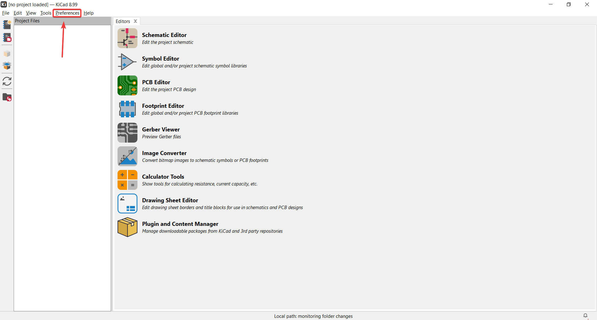
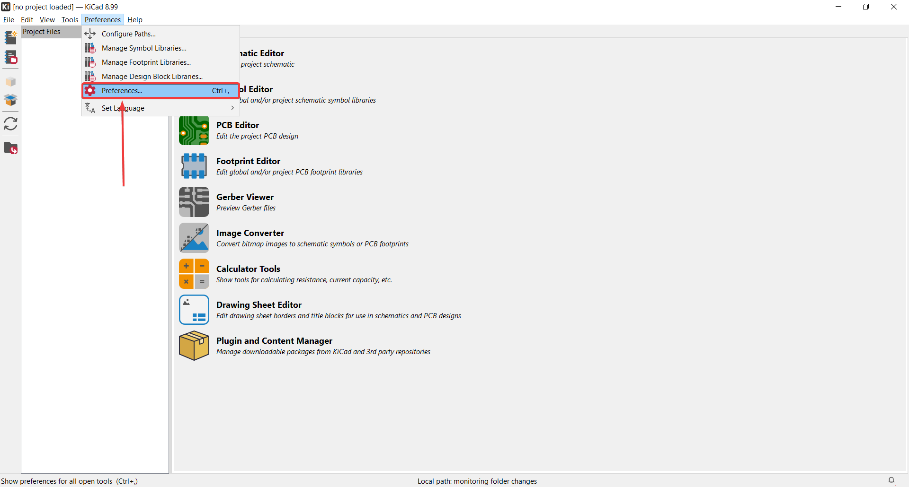
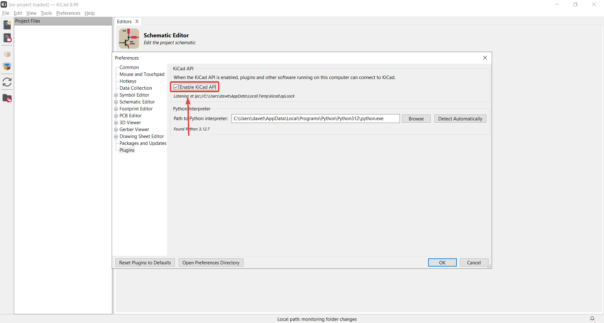

# kicad-wakatime

**kicad-wakatime** is a WakaTime plugin for [KiCAD](https://www.kicad.org/) 8.99.

## Installation

On all platforms:
1. Download the latest release of kicad-wakatime from the releases section.
2. Enable the KiCAD API in KiCAD 8.99. (Preferences -> Preferences -> Plugins -> Enable KiCAD API)
3. Enable the auto save feature in KiCAD 8.99. (Settings -> Common -> Auto save)
4. Open kicad-wakatime and fill out the settings.
5. Start designing!

## Downloading KiCAD 8.99

If you are a Windows user, you can download KiCAD 8.99 [here](https://downloads.kicad.org/kicad/windows/explore/nightlies) (pick an "x86_64.exe".)

If you are a macOS user, you can download KiCAD 8.99 [here](https://downloads.kicad.org/kicad/macos/explore/nightlies) (pick a ".dmg").

If you are an Ubuntu user, you can install KiCAD 8.99 using the following shell commands:

```shell
sudo add-apt-repository --yes ppa:kicad/kicad-dev-nightly
sudo apt update
sudo apt install kicad-nightly
```

## Issues

If kicad-wakatime is not doing what you expect, please [open an issue](https://github.com/hackclub/kicad-wakatime/issues).

The bug report template will ask you for a magic word to confirm that you've read this README.\
The magic word is **"dreadnought"**.

Please make sure you're running KiCAD 8.99 (**not** KiCAD 8.0!) and the KiCAD API is enabled.

# Frequently Asked Questions (FAQs)
<ol type="1">
    <li>
        Where can I find Enable KiCad API?
        
        
        
        
    </li>
</ol>